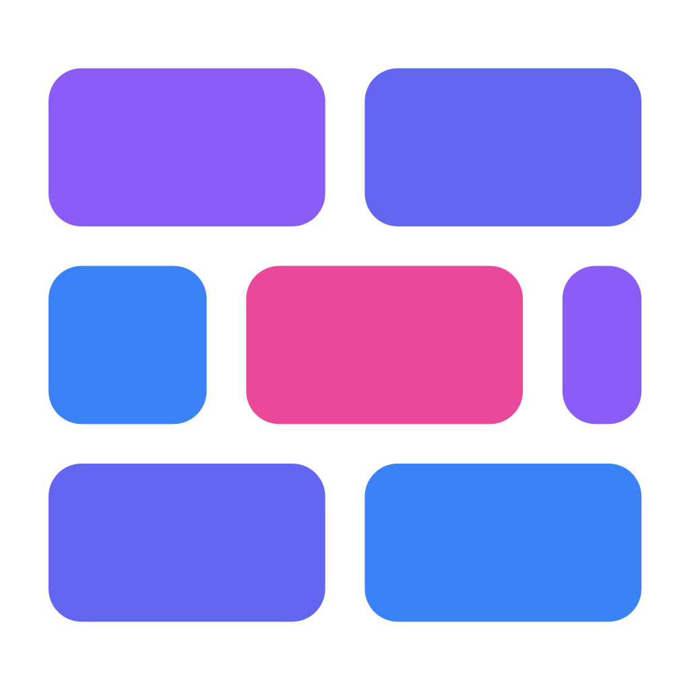
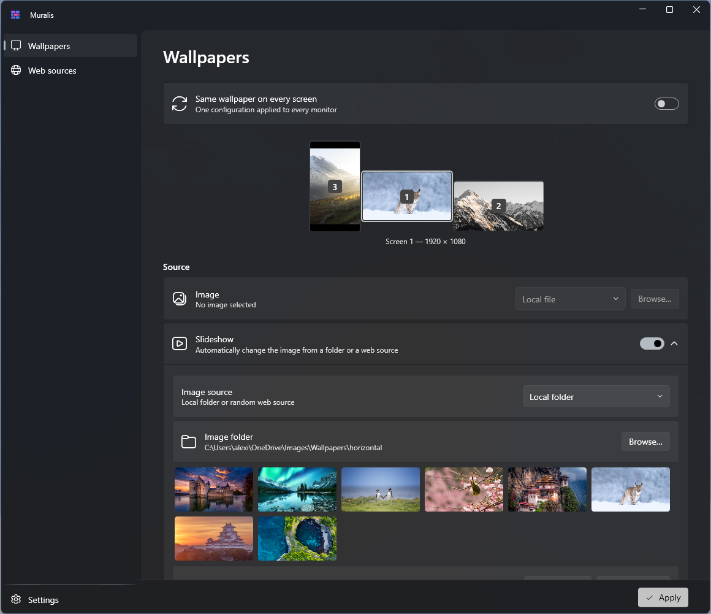
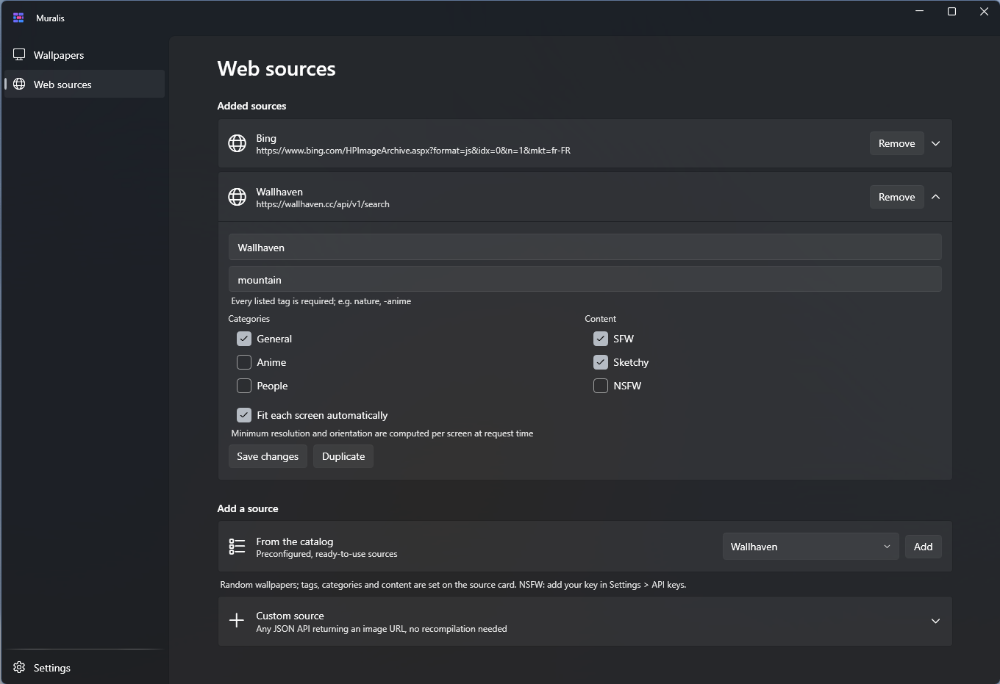
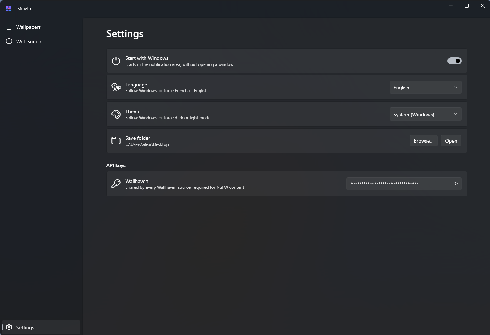

<p align="center">
  
</p>

<h1 align="center">Muralis</h1>

<p align="center">
  A tray-first, multi-monitor wallpaper manager for Windows 11.
  <br />
  <a href="https://github.com/Arkatul/muralis/releases/latest"></a>
  <a href="LICENSE"></a>
</p>

Muralis lives in the notification area and gives every monitor its own wallpaper setup — a fixed image, a local-folder slideshow, or a web source — with a display mode chosen per screen. The UI is built with WPF and Fluent design (Mica), and blends into Windows 11 Settings.



## Features

- **Per-screen configuration** — each monitor gets its own source (fixed image, slideshow, or web) and its own display mode (fill, fit, stretch, center, tile), or one unified setup for all screens (including span). The monitor selector mirrors your real desktop layout, with live thumbnails of the applied wallpapers.
- **Slideshows** — from a local folder (shuffled or alphabetical, any interval) or from a random web source.
- **Web sources** — Bing image of the day (auto-refreshed) and Wallhaven out of the box. The Wallhaven form covers tags (every listed tag required, `-` to exclude), categories and content filters, and can **fit each screen automatically**: minimum resolution and orientation are computed per monitor at request time, so one source serves portrait images to portrait screens. Results are fetched a page at a time to respect API quotas.
- **Multiple instances** — add the same source several times with different settings (e.g. a `Wallhaven landscape` and a `Wallhaven portrait`), rename and duplicate them freely.
- **Custom sources** — any JSON API that returns an image URL works without recompiling: request URL + JSON path (e.g. `images[0].url`) + optional API-key header.
- **API keys** — stored once per provider in Settings, encrypted with Windows DPAPI (never in clear text on disk).
- **Save what you see** — keep the currently displayed web wallpaper from the tray menu or from the monitor selector, with its original file name, into a folder of your choice.
- **Bilingual** — English and French, switchable at runtime; system, dark or light theme; optional start with Windows.

| Web sources | Settings |
| --- | --- |
|  |  |

## Installation

Download `Muralis-Setup-x.y.z.exe` from the [latest release](https://github.com/Arkatul/muralis/releases/latest) and run it — the installer is bilingual (English/French) and the app is self-contained, no runtime to install. An optional task starts Muralis with Windows, minimized to the tray.

Settings and caches live in `%LocalAppData%\Muralis` (per-user); uninstalling removes the app and its registry entries.

## Custom web sources

Any API that answers a GET request with JSON containing an image URL can feed a slideshow or a daily wallpaper. For example, NASA's Astronomy Picture of the Day:

| Field | Value |
| --- | --- |
| Request URL | `https://api.nasa.gov/planetary/apod?api_key=DEMO_KEY` |
| JSON path | `hdurl` |
| Type | Image of the day |

The optional header/key pair covers APIs that authenticate via an HTTP header (e.g. `X-API-Key`).

## Building from source

Requirements: [.NET 10 SDK](https://dotnet.microsoft.com/download) (Windows).

```powershell
git clone https://github.com/Arkatul/muralis.git
cd muralis
dotnet build src/Muralis/Muralis.csproj
```

To produce the installer (requires [Inno Setup 6](https://jrsoftware.org/isinfo.php)):

```powershell
.\installer\build.ps1   # publishes a self-contained single file and compiles dist\Muralis-Setup-x.y.z.exe
```

## License

Muralis is free software, released under the [GNU General Public License v3.0](LICENSE). You may use, study, share and modify it; derivative works must remain open source under the same license.
